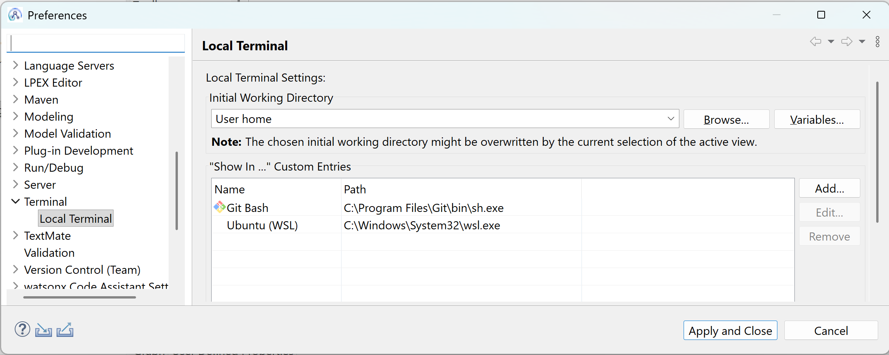
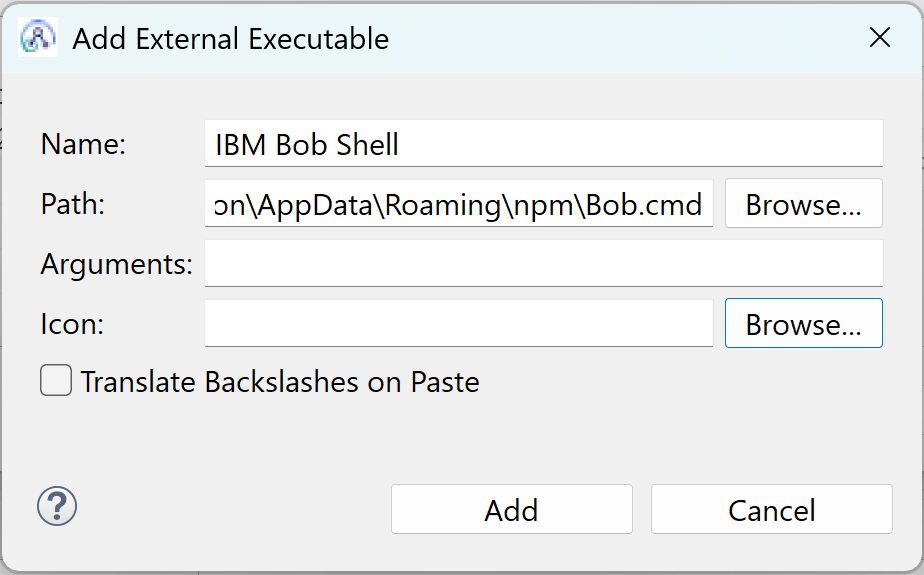
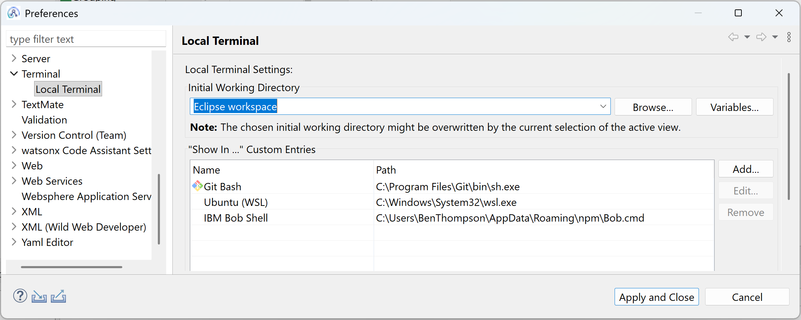
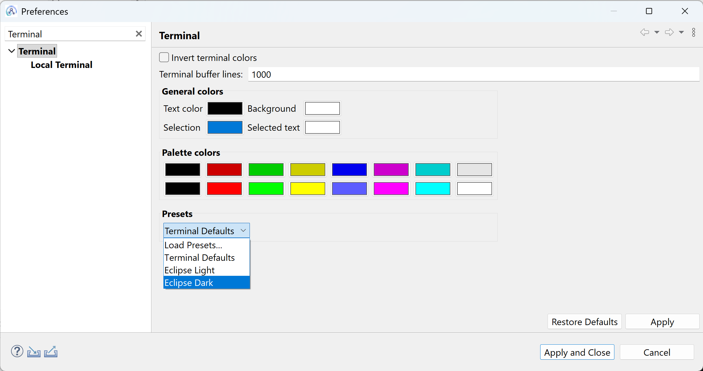
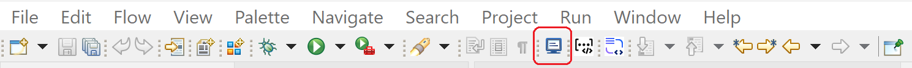
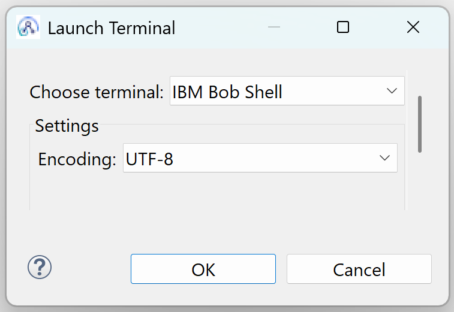
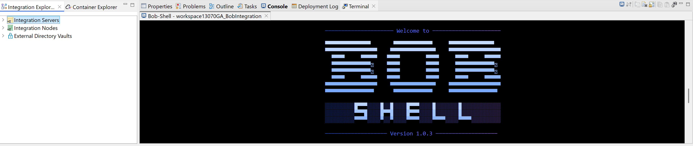
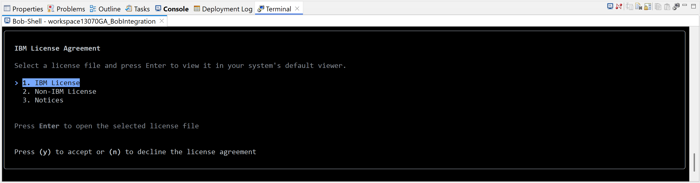
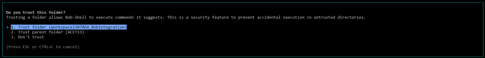
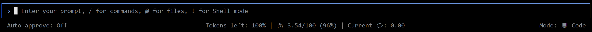

# ace-bob
This repo provides step-by-step instructions for how to get up and running with IBM Bob within the ACE Toolkit: 
* Installing IBM Bob Shell
* Running IBM Bob Shell in ACE Toolkit (by creating a Terminal window shortcut and preferences)
* Configuring the ace-bob IBM Bob skill (This teaches IBM Bob the art of creating message flows and ESQL that follow best practices)

## Installing IBM Bob Shell
1. The ACE Toolkit runs on Windows, xLinux or MacOS. You can find detailed instructions for installing IBM Bob shell on each of these platforms [here](https://bob.ibm.com/docs/shell/getting-started/install-and-setup). Focussing on Windows, you can open Powershell and install IBM Bob Shell using this command:

   ```irm -Uri "https://bob.ibm.com/download/bobshell.ps1" | iex```


## Running IBM Bob Shell in ACE Toolkit

1. Start the ACE Toolkit and from the Toolkit's Window menu choose Preferences. When the Preferences pop-up opens navigate to the section **Terminal > Local Terminal** and click the **Add** button (on the right hand side of the window):

   

2. In the resulting dialog provide the following details and then click the **Add** button:

   * Name = **IBM Bob Shell**
   * Path = **C:\Users\YourUserName\AppData\Roaming\npm\Bob.cmd**
   <br />
   

3. Control will return back to the previous Preferences window. From the drop-down menu change the Initial Working Directory to be **Eclipse workspace** and then click the **Apply and Close** button.

   

4. From the **Window menu**, choose **Preferences** again. When the **Preferences** window opens, use the filter to navigate to the section **Terminal**. From the **Presets** drop-down, select **Eclipse Dark** and click the **Apply and Close** button:

   

5. From the top Toolbar in the Toolkit, click the **Terminal** shortcut (shown in the red box below):

   

6. From the Launch Terminal pop-up, select IBM Bob Shell from the **Choose terminal** dropdown and click OK:

   

7. An IBM Bob Shell Terminal will open. By default it will be located at the bottom of the screen:

   

8. Scroll down and (on first use) you will be presented with a dialog to accept the IBM Bob License:

   

9. Next you will be asked to trust the folder. Due to our earlier set-up we have chosen to launch IBM Bob's workspace to match the ACE Toolkit's Eclipse workspace directory. This makes it easier to use IBM Bob to interact with ACE Toolkit files in the local workspace.

   

10. If you've already been using IBM Bob then he may ask you to trust other directories as well. Once you have made these decisions IBM Bob Shell will be ready to respond to queries as shown below:

   

## Configuring the ace-bob IBM Bob skill

Skills are reusable instruction sets that teach IBM Bob about specialized tasks so they can be completed in a consistent, repeatable manner. When you activate a skill, IBM Bob receives the skill's instructions and gains access to any supporting files in the skill directory. Bob then follows these instructions to complete your task according to the defined workflow. Skills load once per conversation to avoid duplicate prompts. Bob automatically determines when to activate a skill based on your request and the skill's description.

When operating IBM Bob Shell in the ACE Toolkit, the prior configuration steps documented above have targetted your ACE Toolkit Eclipse workspace to be the IBM Bob project root directory. So, to make skills available for IBM Bob Shell in this context, navigate to this ACE Toolkit Eclipse workspace and if it does not already exist, create a folder called **/.bob Alternatively if you want to use IBM Bob across multiple ACE Toolkit workspaces, you might prefer to define ACE skills globally in your user's home directory. Based on my experiences, the best choice would be to locate the skill in the .bob folder within your Toolkit workspace as this improves the chances of Bob being able to find it and use it consistently.

To help you get up and running with using Bob with ACE, we've been trying out different approaches for the structure of an ACE Bob skill. You can find the skill definition in this repository. The skill teaches IBM Bob about the structure of IBM ACE Toolkit Eclipse projects, the art of creating message flows and ESQL that follows best practices. You can git clone the ace-bob skill into the .bob folder of your ACE Toolkit workspace as shown below:


## Future To-Do List for refining the IBM Bob Skill
* DONE: Tell the Skill where to locate the MessageFlow.xsd to avoid Bob guessing at the class names for nodes (often Bob will incorrectly guess at ComIbmHTTPInput for example)
* DONE: Teach Bob about the structure of Eclipse projects including the .project file and Application descriptor
* DONE: Declare REFERENCEs in order to minimize CPU spend on navigation of the logical tree (especially when dealing with heavily nested structures)
* Tell Bob what to do about subflow division and the use of dependent libraries.
* Avoid multiple consecutive Compute nodes where possible (tree copying expensive)
* Do not use CARDINALITY statement inside loops
* Minimize the use of String manipulation functions
* Make ESQL code as efficient as possible by minimizing the number of statements
* Use the LASTMOVE or CARDINALITY statement when wanting to check for the existence of a field
* Use the CREATE with PARSE statement in preference to serialising a copy of the logical tree
* Encourage the use of the Catch terminal at the start of the message flow in preference to the messy flow design of wiring every Failure terminal of individual nodes
* Add something about Compute mode and when to make the Compute node responsible for tree copying versus just editting isolated areas of the tree such as LocalEnvironment
* Give a list of ESQL functions that do NOT exist to avoid Bob making silly mistakes (eg CHECKSUM)
